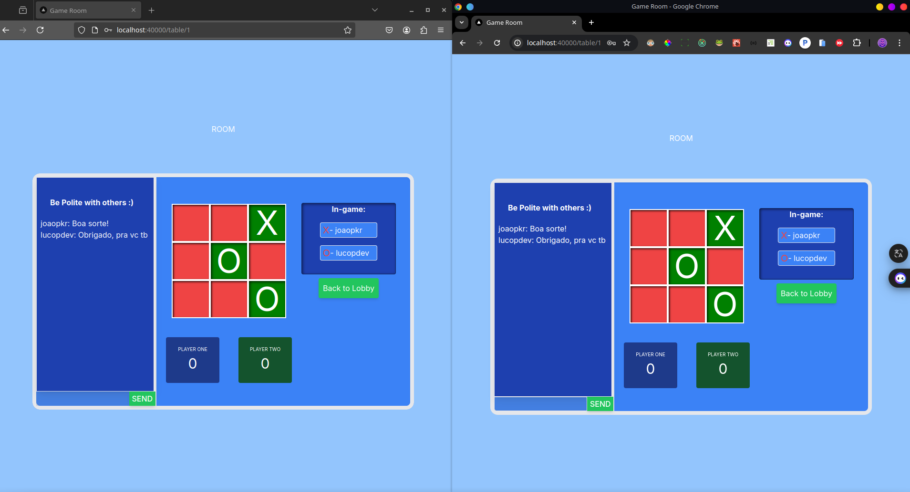

# Jogo da Velha Multiplayer Online

Bem-vindo ao <b>Jogo da Velha Multiplayer Online!</b> Este é um jogo clássico reinventado com a funcionalidade de <b>chat em tempo real</b>, tornando a diversão ainda mais interativa.

## Funcionalidades

- **Jogo da Velha Online**: Desafie amigos ou jogue contra adversários aleatórios em partidas empolgantes do Jogo da Velha.
- **Chat em Tempo Real**: Interaja com seus oponentes e amigos em nosso chat em tempo real durante o jogo.
- **[EM DESENVOLVIMENTO] Registro de Pontuação**: Acompanhe suas vitórias e derrotas com um sistema de pontuação.
- **[EM DESENVOLVIMENTO] Lobby de Jogadores**: Veja quem está online e disponível para jogar em nosso lobby de jogadores.
- **Melhores Práticas**: Seguimos as melhores práticas para oferecer uma experiência de jogo multiplayer estável e segura.

## Tecnologias Usadas

- JavaScript
- Node.js
- Next.js
- Express
- Socket.io
- Prisma
- Zod

## Status Atual

O **Jogo da Velha Multiplayer Online** está totalmente operacional, oferecendo a você a oportunidade de se divertir com amigos e competir contra outros jogadores. No entanto, estamos cientes de que há melhorias a serem feitas, incluindo ajustes na pontuação e permanencia de dados para score global, salas, entre outros.

Sinta-se à vontade para contribuir e fazer parte do desenvolvimento contínuo deste emocionante projeto!

